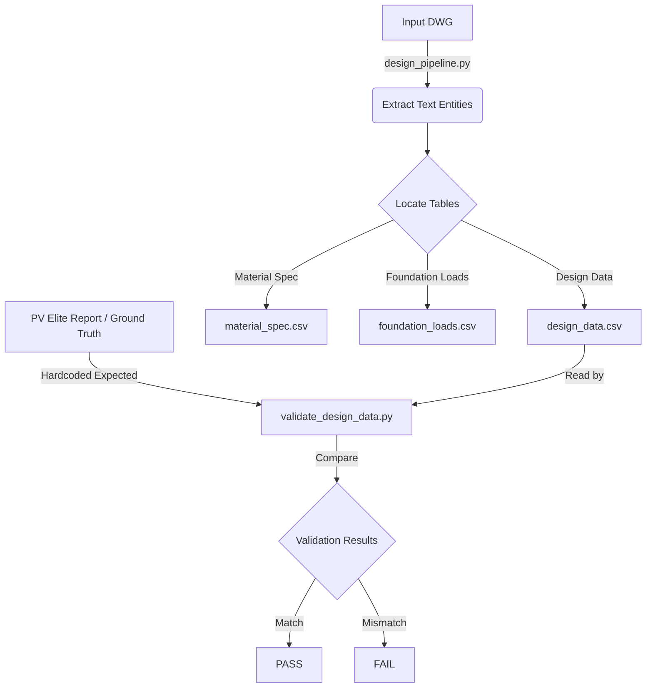

# Asquareic Notes Checker

This folder contains an automated pipeline designed to extract engineering design parameters from AutoCAD drawings (DWG/DXF files) and validate them against expected values from a mechanical calculation report (e.g., PV Elite). 

The system acts as an automated quality-control "checker" to ensure that the data printed on the final CAD drawings perfectly matches the approved mechanical calculations.

## 📂 Core Components

The folder is driven by two main Python scripts working in sequence:

### 1. `design_pipeline.py` (The Extractor)
This script is responsible for extracting structured tabular data directly from the raw AutoCAD files. 
- **DWG Loading & Conversion**: It uses `ezdxf` to read the CAD files. If the file is in an older or unsupported DWG format, it automatically falls back to using the ODA File Converter to convert it to a readable DXF format.
- **Entity Collection**: It scrapes all text entities (`TEXT` and `MTEXT`) from the drawing, filtering them by text height.
- **Table Anchoring & ROI**: It looks for specific anchor phrases (e.g., `"DESIGN DATA"`, `"MATERIAL SPEC"`) and defines a Region of Interest (ROI) bounding box relative to the anchor's coordinates to isolate the tables.
- **Positional Parsing**: Because CAD text is unstructured, it uses the geometric coordinates (X, Y) of the text to cluster them into columns and align labels with their corresponding values.
- **Outputs**: It dumps the extracted tables into the `reports/` directory as CSV files, an aggregated XLSX workbook, and a formatted HTML dashboard.

### 2. `validate_design_data.py` (The Validator)
Once the CAD data is extracted into CSV format, this script performs the cross-check against the ground truth.
- **Input Consumption**: It reads `reports/design_data.csv` generated by the pipeline.
- **Ground Truth**: It contains a dictionary of expected values (`expected` map) which represent the approved mechanical constraints (e.g., from a PV Elite `.docx` report). 
- **Validation Engine**: It loops through the extracted CAD fields and does a substring comparison against the expected values.
- **Outputs**: It prints a console report explicitly marking each field as `PASS` or `FAIL`.

## 🔄 How the Workflow Operates

## 📁 Directory Structure

- **`inputs/`**: Where the source files reside (e.g., `.dwg` CAD files, PV Elite `.docx` reports).
- **`reports/`**: The output directory for `design_pipeline.py`. Contains the CSV data, Excel workbook, and HTML summary.
- **`MDS/`, `New folder/`, `Solidworks 3-d model/`**: Supplemental directories likely containing mechanical datasheets, references, or 3D CAD equivalents for the vessels being checked.

## ⚠️ Known Limitations
> [!WARNING]
> The validation script currently relies on a hardcoded `expected` dictionary mapped to a specific PV Elite document (`Biocide Chemical Injection 6209-04.docx`). To make this a generic checker for any vessel, `validate_design_data.py` would need to be updated to automatically parse the target `.docx` or `.pdf` PV Elite report dynamically. 

> [!NOTE]
> The `validate_design_data.py` script warns about potential misaligned rows. Because DWG tables are manually drafted, slight geometric variations in the CAD file can cause the extractor to occasionally misalign a label and a value, requiring human review if a `FAIL` occurs.
